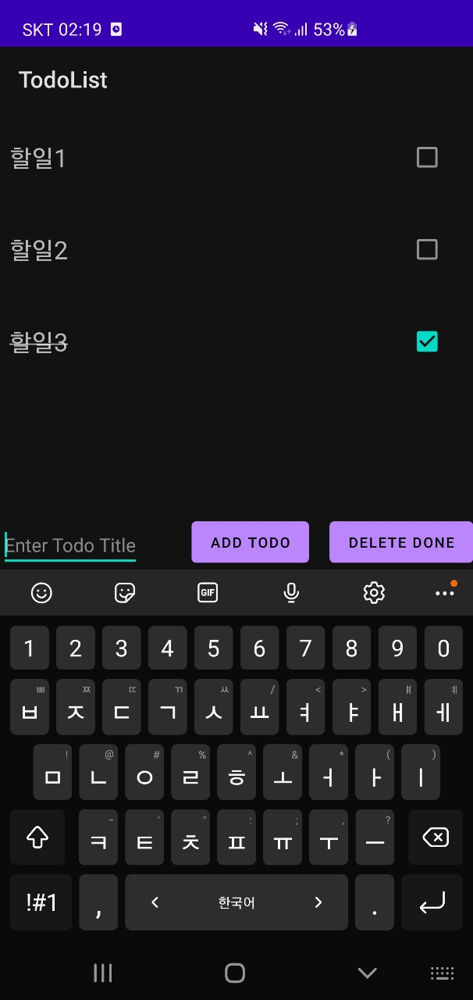

# Try Android & Kotlin

- [Android Projects](./projects)
- [Kotlin](./kotlin)

## Gradle

`gradle`은 빌드 엔진이다.

## Android Studio 세팅

### format on save

- edit -> Macros -> Start Macro Recording
- <kbd>shift</kbd> + <kbd>option</kbd> + <kbd>cmd</kbd> + <kbd>L</kbd> 으로 설정 확인
- 레코딩 시작
  - <kbd>option</kbd> + <kbd>cmd</kbd> + <kbd>L</kbd>
  - <kbd>cmd</kbd> + <kbd>S</kbd>
- edit -> Macros -> Stop Macro Recording ("format on save")
- preferences -> keymap -> "format on save" 를 <kbd>cmd</kbd> + <kbd>S</kbd> 로 지정

## Trouble Shooting

### xml에 정의된 id를 import할 수 없음

Android Studio 4.1 부터 Kotlin 코드로 ID를 바로 참조하는 기능이 기본적으로 disabled 되었으므로

=> gradle app plugins에 `id 'kotlin-android-extensions'` 추가

## Projects

### [TodoList](./projects/TodoList)

> [Build A Simple Android App With Kotlin](https://youtu.be/BBWyXo-3JGQ)

### [MyFirstApp](./projects/MyFirstApp)

> [Kotlin & Android 12 Tutorial | Learn How to Build an Android App 📱 9+ h FREE Development Masterclass](https://youtu.be/HwoxgUPabMk)

> 중간에 Kotlin Basic는 다른 언어와 비슷, 객체지향적인 개념 또는 이전에 살짝 공부한 Kotlin 내용과 거의 일치해서 빠르게 넘김
